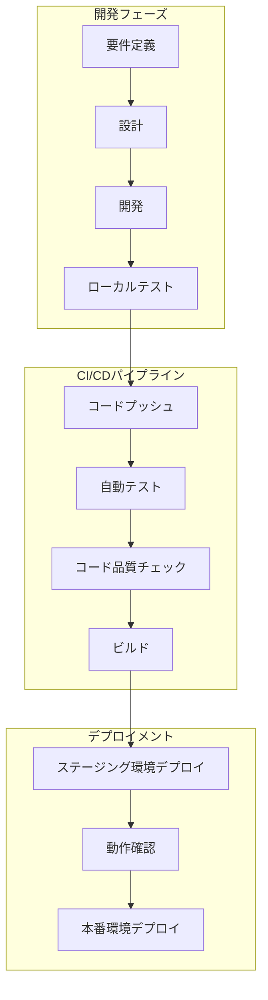

# 【完全版】初心者のためのGitHub実践ガイド 〜TaskManagerアプリ開発で学ぶ〜

## はじめに

プログラミングの世界で必須のスキルとなっているGit/GitHubを、実際のプロジェクトを通じて楽しく学びませんか？

このガイドでは、シンプルな「TaskManager」アプリを作りながら、以下のことを学びます：

- ✅ Git/GitHubの基本的な使い方
- ✅ プロジェクトの変更履歴の管理方法
- ✅ チームでの共同開発の進め方
- ✅ Webアプリの公開方法

### 🎯 このガイドの特徴

- **実践重視**: 実際のプロジェクトを通じて学ぶため、すぐに実務で活かせます
- **ステップバイステップ**: 初心者でも迷わないよう、各手順を詳しく解説します
- **トラブル対策**: よくあるエラーとその解決方法も含めています
- **現場の知識**: 実務でよく使う便利な機能やテクニックも紹介します

### 🔰 対象読者

- プログラミング初心者の方
- Git/GitHubを使ったことがない方
- チーム開発に参加する予定の方
- バージョン管理の基礎を学びたい方

---

## 目次
1. Git/GitHubとは？
2. 事前準備・環境構築
3. プロジェクトフォルダの作成
4. Gitの初期化
5. GitHubリポジトリの作成
6. リモートリポジトリの登録
7. ファイルの作成（HTML/CSS/JS）
8. 変更のステージングとコミット
9. GitHubへのプッシュ
10. READMEの作成とアップロード
10.5. GitHub PagesでWebサイトを公開
11. コードの変更と再プッシュ
12. GitHubからのダウンロード・クローン・ファイル取得
13. ブランチの作成・切り替え・マージ
14. 変更履歴の確認・過去バージョンへの戻し方
15. よくあるトラブルと対処法
15.5. 特定ファイルをレポジトリから削除する方法（ベストプラクティス）
16. 便利Tips・用語集
17. GitHubの全体像と主な機能紹介（特にActions）
18. GitHub Actions ハンズオン入門 〜図書館アプリで学ぶCI/CD〜
19. 🔄 モダンな開発フロー: ベストプラクティス・ガイド

---

## 1. Git/GitHubを理解しよう

### Gitとは？

Gitは「変更履歴を管理するシステム」です。例えば：

- 📝 ファイルの変更履歴を記録できる
- ⏮️ 過去のバージョンに戻すことができる
- 🔀 複数の作業を並行して進められる

### GitHubとは？

GitHubは「Gitで管理したプロジェクトをインターネット上で共有できるサービス」です：

- 🤝 チームでのプロジェクト共有
- 🌐 コードの公開・共有
- 👥 共同開発の実施
- 🔧 プロジェクトの課題管理

### 活用例

- 📱 アプリ開発のソースコード管理
- 📄 ドキュメントの版管理
- 🎨 デザインファイルの履歴管理
- 📚 チーム内での知識共有

### このセクションで学ぶこと

- Gitの基本的な概念
- GitHubの主な機能
- バージョン管理の重要性

## 2. 開発環境を整えよう

### 必要なツール

1. **Git**のインストール
   - Windows: [Git for Windows](https://gitforwindows.org/)からダウンロード
   - macOS: `brew install git`（Homebrewを使用）
   - インストール確認: ターミナルで`git --version`を実行

2. **GitHubアカウント**の準備
   - [GitHub公式サイト](https://github.com/)でアカウント作成
   - メールアドレスの確認を忘れずに
   - プロフィール情報の設定

3. **ターミナル**の準備
   - macOS: 標準の「ターミナル」アプリ
   - Windows: 「Git Bash」（Git for Windowsに含まれる）

### 初期設定

Gitに自分の情報を設定します：
```bash
git config --global user.name "あなたの名前"
git config --global user.email "あなたのメールアドレス"
```

### 動作確認

すべて準備できたか確認しましょう：
1. ターミナルを開く
2. `git --version`を実行
3. バージョン番号が表示されればOK！

### トラブルシューティング

- Gitコマンドが見つからない場合：パスが正しく設定されているか確認
- GitHub接続エラー：ネットワーク設定を確認

## 3. プロジェクトフォルダの作成
```zsh
mkdir ~/projects/github/taskmanager
cd ~/projects/github/taskmanager
```

## 4. Gitの初期化
```zsh
git init
```

## 5. GitHubリポジトリの作成
1. [GitHub](https://github.com/)で「＋」→「New repository」
2. Repository nameに `taskmanager` と入力し「Create repository」

## 6. リモートリポジトリの登録
```zsh
git remote add origin https://github.com/ユーザー名/taskmanager.git
```

## 7. ファイルの作成（HTML/CSS/JS）
- `index.html`, `style.css`, `app.js` を作成（AIやエディタで雛形生成もOK）
- ファイルがプロジェクトフォルダに存在することを確認
- **ポイント:** ファイル名のスペルミスや拡張子ミスに注意！

## 8. 変更のステージングとコミット
- **ステージング(add)**: 変更を「次の記録対象」として選ぶ作業
- **コミット(commit)**: ステージした変更を「履歴」として記録
- **ポイント:** こまめなコミットで履歴が分かりやすくなります

```zsh
git add .
git commit -m "初回コミット: TaskManagerアプリの雛形作成"
```

## 9. GitHubへのプッシュ
- **プッシュ(push)**: ローカルの履歴をGitHubにアップロード
- **ポイント:** 初回は `git branch -M main` でmainブランチに統一

```zsh
git branch -M main
git push -u origin main
```

## 10. READMEの作成とアップロード
- **README.md**: プロジェクトの説明書。GitHubで最初に読まれる大事なファイル
- **ポイント:** 使い方・特徴・ライセンス・連絡先なども書くと親切

1. `README.md` を作成（アプリ概要・特徴・使い方・ファイル構成など記載）
2. アップロード：
```zsh
git add README.md
git commit -m "README.md追加"
git push
```

## 10.5. GitHub PagesでWebサイトを公開
- **GitHub Pages**とは：GitHubリポジトリの内容を直接Webサイトとして公開できる機能
- **メリット**：無料、簡単設定、HTTPSサポート、カスタムドメイン対応

### 手順
1. **GitHub Pagesを有効化**
   - リポジトリページの「Settings」タブをクリック
   - 左メニューから「Pages」を選択
   - 「Source」セクションで以下を設定：
     - Branch: `main`（または公開したいブランチ）
     - フォルダ: `/(root)` または `/docs`

2. **公開設定の確認**
   - 設定完了後、「Your site is published at https://ユーザー名.github.io/リポジトリ名/」というメッセージが表示
   - このURLがWebサイトの公開アドレス

3. **index.htmlの配置**
   - リポジトリのルート（または設定したdocsフォルダ）に`index.html`を配置
   - このファイルがWebサイトのトップページに

4. **変更を反映**
```zsh
git add index.html
git commit -m "feat: トップページの追加"
git push
```

5. **動作確認**
   - 数分後、表示されたURLにアクセス
   - 正しく表示されることを確認
   - 反映には最大10分程度かかる場合も

### Tips
- カスタムドメインを使用する場合は「Custom domain」に設定
- Jekyll対応：マークダウンファイルも自動的にHTMLに変換
- デプロイ状況は「Actions」タブで確認可能

---

## 11. コードの変更と再プッシュ
- **ポイント:** 複数ファイルを一括でadd/commit/pushできる
- **コミットメッセージ**は「何を・なぜ」変更したか簡潔に

### 複数ファイルをまとめてコミット・プッシュしたい場合
- いくつかのファイルを同時に編集した場合、1つずつadd/commit/pushする必要はありません。
- すべての変更をまとめて以下のコマンドで一括反映できます。

```zsh
git add .
git commit -m "複数ファイルの変更をまとめてコミット"
git push
```

1. 例: `app.js` を編集し機能追加
2. 変更を保存後、
```zsh
git add app.js
git commit -m "app.js: タスク追加機能を実装"
git push
```

## 12. GitHubからのダウンロード・クローン・ファイル取得
- **clone**: リポジトリ全体を自分のPCにコピー
- **pull**: 既存リポジトリを最新状態に更新
- **個別ファイルDL**: Webから直接保存も可能

### リポジトリごとクローン
```zsh
git clone https://github.com/ユーザー名/taskmanager.git
```
### 既存リポジトリを最新化
```zsh
git pull origin main
```
### 個別ファイルだけダウンロード
1. GitHubで該当ファイルを開き「Raw」→右クリック「名前を付けて保存」

## 13. ブランチの作成・切り替え・マージ
- **ブランチ**: 新機能や修正を安全に試すための「作業用コピー」
- **ポイント:** main以外で作業→mainにマージが安全な流れ

- **新しいブランチ作成**
```zsh
git checkout -b feature/新機能名
```
- **ブランチ切り替え**
```zsh
git checkout main
```
- **mainへマージ**
```zsh
git checkout main
git merge feature/新機能名
```

## 14. 変更履歴の確認・過去バージョンへの戻し方
- **log**: 変更履歴の一覧
- **checkout**: 過去の状態に戻す
- **ポイント:** うっかりミスも履歴から復元できる

- **履歴一覧**
```zsh
git log --oneline
```
- **特定ファイルの履歴**
```zsh
git log ファイル名
```
- **過去の状態に戻す（例: 1つ前のコミット）**
```zsh
git checkout HEAD^ ファイル名
```

## 15. よくあるトラブルと対処法
- **エラー文はよく読む！** そのまま検索すると解決策が見つかることも多い
- **ポイント:** 何か困ったらまず `git status` で状況確認

- **push時にエラーが出る場合**
  - `git pull --rebase origin main` で最新を取得してから再度 `git push`
- **リモートURLを間違えた場合**
  - `git remote set-url origin 新しいURL` で修正
- **コミットメッセージを間違えた場合**
  - 直前なら `git commit --amend` で修正
- **ファイルを間違って消した場合**
  - `git checkout HEAD -- ファイル名` で復元

## 15.5. 特定ファイルをレポジトリから削除する方法（ベストプラクティス）
- **ポイント:** `git rm`で削除→commit→push。消しすぎたら`git checkout`で復元

- 不要になったファイルをGitHubリポジトリから削除したい場合は、以下の手順で安全に削除できます。

```zsh
git rm ファイル名
# 例: git rm old.txt

git commit -m "不要ファイル old.txt を削除"
git push
```
- `git rm` でワークツリーとステージから削除され、コミット＆プッシュでリモートからも消えます。
- **.gitignore**に追加すれば今後は追跡されません。
- うっかり消した場合は `git checkout HEAD -- ファイル名` で直前の状態に復元可能。

## 16. 便利Tips・用語集
- **.gitignore**: Git管理対象外にしたいファイル・フォルダを記載
- **差分確認**: `git status`, `git diff`
- **リモートリポジトリ一覧**: `git remote -v`
- **GitHub PagesでWeb公開**: 設定→Pages→mainブランチを選択
- **Pull Request（PR）**: 複数人開発時のレビュー・マージ申請機能
- **Fork**: 他人のリポジトリを自分のアカウントにコピー
- **Issue**: バグ報告やタスク管理用のチケット
- **参考:** [GitHub公式ドキュメント](https://docs.github.com/ja)

---

## GitHubの全体像と主な機能紹介（特にActions）

GitHubは単なる「ソースコードの置き場」ではありません。以下のような多彩な機能があり、個人開発からチーム・企業の本格運用まで幅広く活用されています。

### 代表的な機能一覧
- **リポジトリ（Repository）**: プロジェクトごとのファイル・履歴管理の単位
- **ブランチ/マージ**: 複数人・複数機能の同時開発を安全に実現
- **Pull Request（PR）**: コードレビューや共同作業のための申請・議論・マージ機能
- **Issue**: バグ報告・要望・タスク管理などのチケットシステム
- **Wiki**: プロジェクトごとのドキュメント管理
- **Projects**: カンバン方式のタスク管理ボード
- **GitHub Pages**: 静的Webサイトの無料ホスティング
- **Releases**: バージョンごとの配布物管理
- **Actions**: CI/CD（自動テスト・自動デプロイなど）をノーコードで実現できる自動化機能

### Actionsとは？
- **GitHub Actions**は、リポジトリ内の「.github/workflows」フォルダにYAMLファイルを置くだけで、
  - コードのpush/pull request時に自動でテスト・ビルド・デプロイ
  - Lintやフォーマットチェック、ドキュメント生成、Slack通知など
  - さまざまな自動化を「無料枠」で簡単に実現できます
- 公式・コミュニティ製の「Action（部品）」を組み合わせて、複雑なワークフローもノーコードで構築可能
- 例: Node.jsアプリの自動テスト
```yaml
name: Node.js CI
on: [push]
jobs:
  build:
    runs-on: ubuntu-latest
    steps:
      - uses: actions/checkout@v3
      - uses: actions/setup-node@v3
        with:
          node-version: '18'
      - run: npm install
      - run: npm test
```
- 詳細は[GitHub Actions公式ドキュメント](https://docs.github.com/ja/actions)を参照

### その他の便利機能
- **Codespaces**: ブラウザ上でVS Code環境を即座に起動し、どこでも開発可能
- **Dependabot**: 依存パッケージの脆弱性自動検知・アップデート提案
- **Security/Insights**: セキュリティ診断やコントリビューション分析
- **Marketplace**: 便利なActionやアプリを検索・導入

---

GitHubは「コード管理」だけでなく、開発・運用・コラボレーション・自動化まで一気通貫でサポートする強力なプラットフォームです。興味が湧いた機能から少しずつ触れてみましょう！

---

このチュートリアルに沿って進めれば、GitHubの基本から実践まで一通り体験できます。困ったときはAI（GitHub Copilot）や公式ドキュメントも活用しましょう！

---

# GitHub Actions ハンズオン入門 〜図書館アプリで学ぶCI/CD〜

このセクションでは、実際に図書館アプリケーションを使用して、GitHub Actionsの基本から実践的な使い方までをハンズオン形式で学びます。

## 目次
1. GitHub Actionsとは？
2. 最初のワークフロー作成
3. 自動テストの設定
4. GitHub Pagesへの自動デプロイ
5. コード品質チェックの自動化

## 1. GitHub Actionsとは？

GitHub Actionsは、リポジトリ内で発生するイベント（プッシュ、プルリクエストなど）をトリガーに、自動的にタスクを実行できる機能です。

主な用途：
- 🔄 自動テスト実行
- 📦 自動デプロイ
- 🔍 コード品質チェック
- 📝 ドキュメント生成

## 2. 最初のワークフロー作成

### 手順2-1: ワークフローファイルの作成

1. リポジトリ内に `.github/workflows` ディレクトリを作成：
```zsh
mkdir -p .github/workflows
```

2. 最初のワークフローファイル `hello.yml` を作成：
```zsh
touch .github/workflows/hello.yml
```

3. `hello.yml` に以下の内容を記述：
```yaml
name: Hello Actions
on: [push]

jobs:
  hello-job:
    runs-on: ubuntu-latest
    steps:
      - name: Hello Step
        run: echo "🎉 私の最初のGitHub Actions!"
```

4. 変更をコミット＆プッシュ：
```zsh
git add .github/workflows/hello.yml
git commit -m "feat: 最初のGitHub Actionsワークフロー追加"
git push
```

### 手順2-2: 実行結果の確認

1. GitHubリポジトリの「Actions」タブを開く
2. `Hello Actions` ワークフローの実行結果を確認
3. ジョブの詳細を開いて、出力を確認

## 3. プロジェクトタイプに応じた設定選択

プロジェクトの種類によって、必要な設定は大きく異なります。以下のように使い分けましょう：

### 3-1: シンプルな静的サイト（HTML/CSS/JavaScript）の場合

最もシンプルな設定で始められます：

```yaml
name: Deploy Static Site
on:
  push:
    branches: [ main ]

jobs:
  deploy:
    runs-on: ubuntu-latest
    steps:
      - uses: actions/checkout@v3
      
      # HTMLの文法チェック（任意）
      - name: HTML5 Validator
        uses: Cyb3r-Jak3/html5validator-action@v7.2.0
        
      # GitHub Pagesへデプロイ
      - name: Deploy to GitHub Pages
        uses: peaceiris/actions-gh-pages@v3
        with:
          github_token: ${{ secrets.GITHUB_TOKEN }}
          publish_dir: .
```

### 3-2: Node.jsプロジェクトの場合（オプション）

より高度な機能が必要な場合は、以下のような設定を追加できます：

```yaml
name: Node.js App
on: [push, pull_request]

jobs:
  test:
    runs-on: ubuntu-latest
    steps:
      - uses: actions/checkout@v3
      - uses: actions/setup-node@v3
        with:
          node-version: '18'
      - run: npm install
      - run: npm test
```

※ この設定は、package.jsonやNode.js環境が必要な場合のみ使用します。
```

## 4. GitHub Pagesへの自動デプロイ

アプリケーションを自動的にGitHub Pagesにデプロイするワークフローを設定します。

### 手順4-1: デプロイワークフローの作成

`deploy.yml` を作成：

```yaml
name: Deploy to GitHub Pages
on:
  push:
    branches: [ main ]

jobs:
  deploy:
    runs-on: ubuntu-latest
    steps:
      - uses: actions/checkout@v3
      
      - name: Deploy
        uses: peaceiris/actions-gh-pages@v3
        with:
          github_token: ${{ secrets.GITHUB_TOKEN }}
          publish_dir: .
```

### 手順4-2: GitHub Pagesの有効化

1. リポジトリの「Settings」→「Pages」を開く
2. Source を「GitHub Actions」に設定

## 5. コード品質チェックの自動化

ESLintを使用してコード品質を自動チェックするワークフローを設定します。

### 手順5-1: Lintワークフローの作成

`lint.yml` を作成：

```yaml
name: Code Quality Check
on: [push, pull_request]

jobs:
  lint:
    runs-on: ubuntu-latest
    steps:
      - uses: actions/checkout@v3
      
      - name: Setup Node.js
        uses: actions/setup-node@v3
        with:
          node-version: '18'
          
      - name: Install Dependencies
        run: |
          npm install eslint
          npm install eslint-config-airbnb-base
          
      - name: Run ESLint
        run: npx eslint .
```

### 手順5-2: ESLintの設定

`.eslintrc.js` を作成：

```javascript
module.exports = {
    "env": {
        "browser": true,
        "es2021": true
    },
    "extends": "airbnb-base",
    "parserOptions": {
        "ecmaVersion": "latest"
    },
    "rules": {
        // プロジェクトに合わせてカスタマイズ
    }
}
```

## 実践的なTips

1. **シークレットの利用**
   - リポジトリの Settings → Secrets and variables → Actions で設定
   - ワークフロー内で `${{ secrets.SECRET_NAME }}` として参照

2. **キャッシュの活用**
```yaml
- uses: actions/cache@v3
  with:
    path: ~/.npm
    key: ${{ runner.os }}-node-${{ hashFiles('**/package-lock.json') }}
```

3. **マトリックスビルド**
```yaml
strategy:
  matrix:
    node-version: [14.x, 16.x, 18.x]
```

4. **条件付き実行**
```yaml
if: github.event_name == 'push' && github.ref == 'refs/heads/main'
```

## トラブルシューティング

よくある問題と解決方法：

1. **ワークフローが実行されない**
   - ブランチ名やイベントトリガーを確認
   - ワークフローファイルの構文を検証

2. **デプロイが失敗する**
   - 権限設定を確認
   - `GITHUB_TOKEN` の有効性を確認

3. **テストが失敗する**
   - ローカルでテストを実行して確認
   - 環境変数の設定を確認

## まとめ

GitHub Actionsを活用することで：
- ✅ 自動テストによる品質担保
- 🚀 自動デプロイによる効率化
- 📊 継続的なコード品質の監視
が実現できます。

このチュートリアルで学んだ基本を応用することで、さらに複雑な自動化も実現可能です。

---

# 🔄 モダンな開発フロー: ベストプラクティス・ガイド

このセクションでは、Webアプリケーション開発の一般的なベストプラクティスを、図書館アプリを例に解説します。

## 📊 開発ライフサイクルの全体像



## 1. 🎯 開発フェーズ

### 1.1 プロジェクトセットアップ
```zsh
# プロジェクトの初期化
git init
npm init -y

# 必要なパッケージのインストール
npm install jest eslint prettier
```

### 1.2 開発環境の準備
```zsh
# 開発用ブランチの作成
git checkout -b feature/search-function

# ESLintの設定
npm init @eslint/config
```

## 2. 👩‍💻 コーディングフロー

### 2.1 機能開発サイクル
1. **機能ブランチの作成**
```zsh
git checkout -b feature/新機能名
```

2. **ローカル開発**
   - VS Codeでコーディング
   - 定期的な保存とテスト実行

3. **変更のコミット**
```zsh
git add .
git commit -m "feat: 検索機能の実装"
```

### 2.2 コードレビュー準備
1. **プルリクエスト作成**
   - GitHubでPRを作成
   - レビュー担当者の指定

2. **自動チェック確認**
   - GitHub Actionsの実行結果確認
   - テストパスを確認

## 3. 🔄 CI/CDパイプライン

### 3.1 自動テスト
```yaml
name: Test Pipeline
on: [push, pull_request]
jobs:
  test:
    runs-on: ubuntu-latest
    steps:
      - uses: actions/checkout@v3
      - run: npm test
```

### 3.2 品質チェック
```yaml
name: Quality Check
jobs:
  lint:
    runs-on: ubuntu-latest
    steps:
      - run: npm run lint
```

## 4. 🚀 デプロイメントフロー

### 4.1 ステージング環境
1. **自動デプロイ設定**
```yaml
name: Staging Deploy
on:
  push:
    branches: [develop]
```

2. **動作確認項目**
   - ✅ 全機能の動作確認
   - ✅ レスポンシブ対応確認
   - ✅ パフォーマンスチェック

### 4.2 本番環境
1. **デプロイ承認プロセス**
   - PRレビュー完了
   - テスト全パス確認
   - 上長承認取得

2. **本番デプロイ実行**
```yaml
name: Production Deploy
on:
  push:
    branches: [main]
```

## 5. 📈 モニタリングと改善

### 5.1 監視項目
- 📊 アクセス統計
- ⚡ パフォーマンスメトリクス
- 🚨 エラー監視

### 5.2 継続的改善
1. フィードバック収集
2. 改善計画立案
3. 優先順位付け
4. 実装サイクル

## 6. 🔑 セキュリティベストプラクティス

### 6.1 基本対策
- 🔒 環境変数の適切な管理
- 🔑 シークレットの安全な保管
- 🛡️ 依存パッケージの定期更新

### 6.2 セキュリティチェック
```yaml
name: Security Scan
on: [push]
jobs:
  scan:
    runs-on: ubuntu-latest
    steps:
      - uses: actions/checkout@v3
      - name: Run security scan
        run: npm audit
```

## まとめ

このフローに従うことで：
- ✅ 品質の高いコードの維持
- 🚀 効率的な開発プロセス
- 🔒 セキュアなデプロイメント
が実現できます。

チーム規模や要件に応じて、このフローをカスタマイズしていくことをお勧めします。

---
